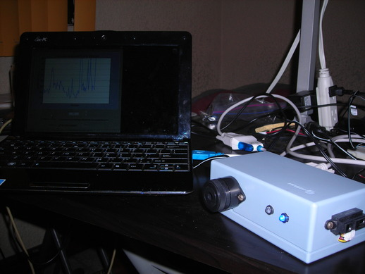

### Distance measurement system

- [Project's website]({{ site.url }}/cerca "cerca project's website")
- [Github repo](https://github.com/{{ site.github_username }}/cerca "cerca's github repo")

Project **cerca** is a PC-based distance measurement system, developed for the
school course *482 - TÓPICOS SELECTOS DMI I* (spanish for selected topics for
intelligent machines design) at [FIME](http://www.fime.uanl.mx)
[UANL](http://www.uanl.mx). cerca has only been tested on Windows XP and Fedora
15 but should work on Windows Vista, Windows 7, Mac OS X, and most Linux
distributions. The software is implemented in Python 2 and C.  cerca was
designed and implemented by [{{ site.author }}]({{ site.url }} "{{ site.description }}"). The
project is publicly released for educational purposes and under permissive
licenses.

Software is released under the Modified BSD license, other original media is
released under the Creative Commons Attribution 3.0 Unported license, see file
[LICENSE.txt](https://github.com/{{ site.github_username }}/cerca/blob/master/LICENSE.txt).

## Version 1.0.4

October 27, 2012.

- [HTML documentation]({{ page.url }}doc)
- [zip release](https://github.com/{{ site.github_username }}/cerca/zipball/v1.0.4)
- [Video demonstration](https://www.youtube.com/watch?v=OE_qz_wE0Hs) at YouTube.
