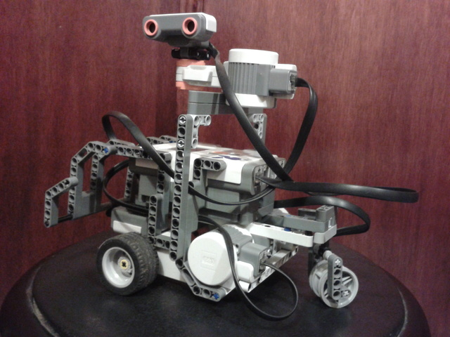

# A robot that autonomously solves a maze

- [Github repo](https://github.com/{{ site.github_username }}/mazerob)
- [HTML documentation][]

Project **mazerob** is a robot that autonomously solves a maze. The system runs
on Java Virtual Machines on a personal computer and a Lego NXT Brick configured
as a master-slave architecture. Project mazerob was supervised by Professor
[Elisa Schaeffer](http://elisa.dyndns-web.com "Elisa Schaeffer") and partially
funded by [UANL](http://www.uanl.mx) through the
[PROVERICYT](http://www.uanl.mx/universidad/investigacion/apoyos/provericyt.html).
See also [UANL - PISIS: Verano Científico](http://pisis.fime.uanl.mx/Verano/estudiantes.html).

## Development version

- [HTML documentation][]
- [zip release](https://github.com/{{ site.github_username }}/mazerob/archive/master.zip)
  (from GitHub repo).
- Video demo

  <iframe width="420" height="315" src="https://www.youtube.com/embed/j-1QjAreghc" frameborder="0" allowfullscreen></iframe>

[HTML documentation]: {{ page.url }}doc
