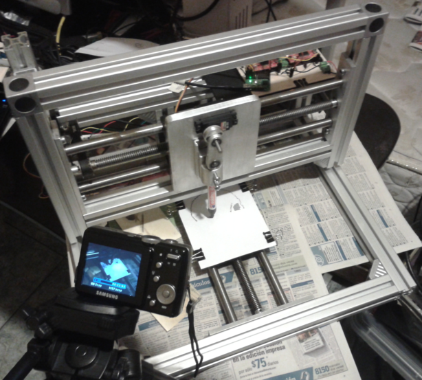

# A CNC printer for binary images

- [Github repo](https://github.com/{{ site.github_username }}/printer73x "printer73x at Github")
- [Online HTML documentation][]

**printer73x** is a CNC system for printing binary images. printer73x was
developed for the school courses _734 - PROYECTO DE IMTC I_ and _735 - PROYECTO
DE IMTC II_ (spanish for _mechatronics project_) at
[FIME](http://www.fime.uanl.mx/en/) [UANL](http://www.uanl.mx/). printer73x has
only been tested on Windows 7 and Fedora but will work on Mac OS X, most Linux
distributions and Windows XP, Vista, 7 and 8.  The software is written mainly in Python 2 and MATLAB.

printer73x 1.0.2 is released for educational purposes.  Multiple licenses apply
for this project, see file
[LICENSE.md](https://github.com/lopezpdvn/printer73x/blob/master/LICENSE.md).

## Version 1.0.2

Released October 27, 2012.

* [Online HTML documentation][]
* [Zip release](https://github.com/lopezpdvn/printer73x/zipball/v1.0.2) (from
    GitHub).
* [Video
  demonstrations](http://www.youtube.com/playlist?list=PL7141B5B35BD03A5E) at
  _YouTube_.

  <iframe width="560" height="315" src="https://www.youtube.com/embed/videoseries?list=PL7141B5B35BD03A5E" frameborder="0" allowfullscreen></iframe>

## Credits

The following people were involved in the development and funding of
printer73x.

Mechanical design and implementation:

*   Ulises Acosta Muñiz
*   Javier Longoria
*   Gregorio Reyes Banda
*   Abraham Arturo Silva Flores

Software and electronic design and implementation:

*   Iván García González
*   [{{ site.author }}]({{ site.url }})

[Online HTML documentation]: {{ page.url }}doc
